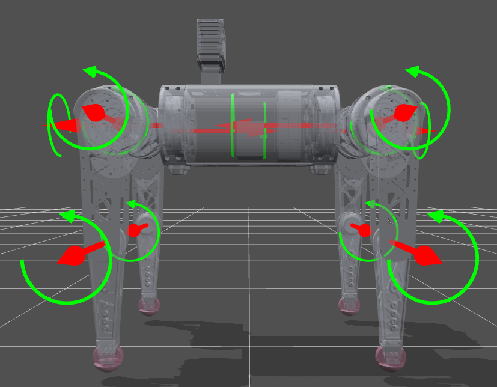
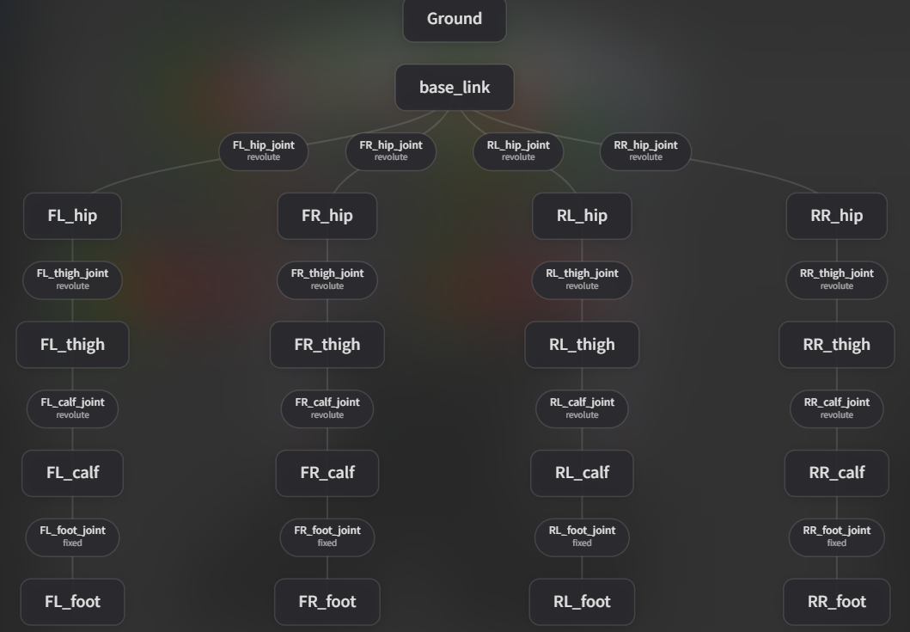
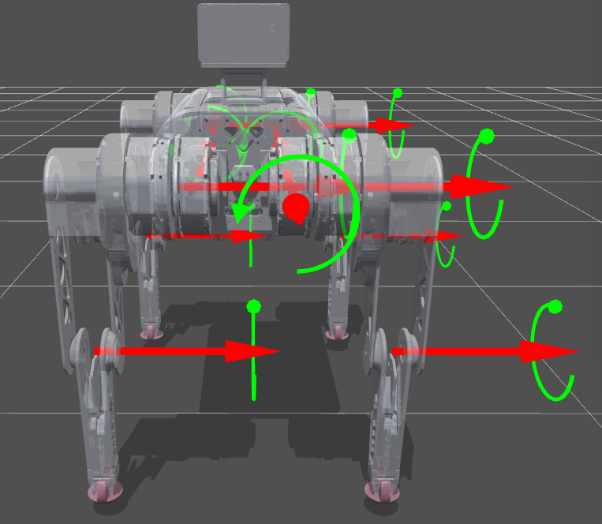
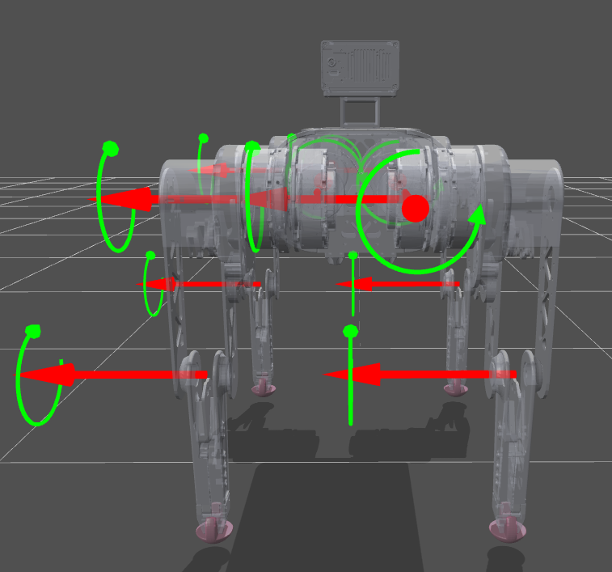

# dog_urdf

A quadruped robot URDF model exported from SolidWorks via [sw_urdf_exporter](http://wiki.ros.org/sw_urdf_exporter).

## Overview



| Property | Value |
|----------|-------|
| Legs | 4 |
| Total links | 17 |
| Total joints | 16 (12 revolute + 4 fixed) |
| Total mass | ~7.2 kg |

## Link Tree

```
base_link
├── FL_hip ── FL_thigh ── FL_calf ── FL_foot [fixed]
├── FR_hip ── FR_thigh ── FR_calf ── FR_foot [fixed]
├── RL_hip ── RL_thigh ── RL_calf ── RL_foot [fixed]
└── RR_hip ── RR_thigh ── RR_calf ── RR_foot [fixed]
```



## Joint Naming & Axes

Prefix: `FL` (front-left), `FR` (front-right), `RL` (rear-left), `RR` (rear-right).

Three revolute joints per leg:

| Joint | Axis | Range | Description |
|-------|------|-------|-------------|
| `*_hip_joint` | **X** (left-right mirrored) | ±0.5 rad | Abduction (+) / Adduction (-) |
| `*_thigh_joint` | **Y** (all same) | -1.6 / +0.8 rad | Forward / backward swing |
| `*_calf_joint` | **Y** (all same) | -2.4 / -0.3 rad | Knee bend (one direction only) |

> **Calf limit rationale:** The lower bound `-2.4 rad` corresponds to the fully folded (lying down) pose, but this URDF is intended for RL-based locomotion training where the policy always starts from and operates near the standing pose. The transition from lying down to standing is handled by open-loop position control before the policy takes over, so the policy never needs access to the extreme folding range. Keeping the limit conservatively wide prevents the policy from exploiting collision rebounds at the mechanical stop, while still reserving enough range for fall recovery if needed.

### Hip Axis Convention (Left-Right Mirrored)

- **Left** (FL, RL): `axis = 1 0 0` → +angle = abduction
- **Right** (FR, RR): `axis = -1 0 0` → +angle = abduction

This ensures all four legs use the same sign convention for abduction/adduction in control code.

## Leg Detail

 

## Collision Models

Collision geometries use simplified primitives for performance:

| Link | Collision Type | Size |
|------|---------------|------|
| base_link | box | 0.30 x 0.12 x 0.08 m |
| FL/FR/RL/RR_hip | cylinder | r=0.025, len=0.06 m |
| FL/FR/RL/RR_thigh | capsule | r=0.03, len=0.18 m |
| FL/FR/RL/RR_calf | capsule | r=0.022, len=0.18 m |
| FL/FR/RL/RR_foot | sphere | r=0.022 m |

## Usage

```bash
# Validate the URDF
check_urdf urdf/dog_urdf.urdf

# Visualize with robot_state_publisher
ros2 launch urdf_tutorial display.launch.py model:=urdf/dog_urdf.urdf
```

## Origin

This URDF was generated by the [SolidWorks to URDF Exporter](https://github.com/ros/solidworks_urdf_exporter) (v1.6.0).
